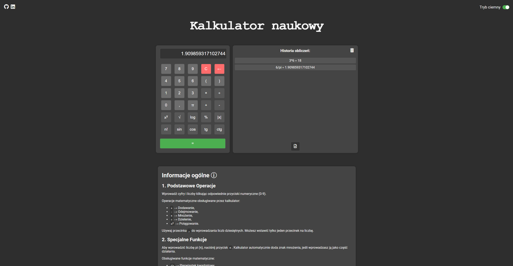

# Kalkulator JavaScript
To jest prosty kalkulator stworzony w JavaScript, który obsługuje podstawowe operacje matematyczne, funkcje specjalne, a także tryb ciemny oraz historię obliczeń. Kalkulator jest przyjazny dla użytkownika i intuicyjny w obsłudze. Projekt nie jest w pełni skończony.

###### Interfejs kalkulatora. Rozdzielczość ekranu: 2560x1440

## Funkcje
1. **Podstawowe operacje**
   - Dodawanie (`+`)
   - Odejmowanie (`-`)
   - Mnożenie (`×`)
   - Dzielenie (`÷`)
   - Potęgowanie (`x^y`)

2. **Specjalne funkcje**
   - Pierwiastek kwadratowy (`√x`)
   - Sinus kąta (`sin`)
   - Cosinus kąta (`cos`)
   - Tangens kąta (`tg`)
   - Cotangens kąta (`ctg`)
   - Logarytm dziesiętny (`log`)
   - Silnia (`n!`)
   - Wartość bezwzględna (`|x|`)

3. **Działania na nawiasach**
   - Umożliwia korzystanie z nawiasów w celu określenia kolejności działań.

4. **Historia obliczeń**
   - Zapisuje każde działanie w historii, którą można zapisać do pliku tekstowego.

5. **Tryb ciemny**
   - Umożliwia włączenie lub wyłączenie trybu ciemnego.
  
   
   ###### Interfejs kalkulatora w trybie ciemnym. Rozdzielczość ekranu: 2560x1440

6. **Resetowanie i usuwanie**
   - Możliwość zresetowania kalkulatora oraz usunięcia ostatnich znaków.

7. **Obliczanie wyników**
   - Umożliwia obliczenie wyniku po wprowadzeniu wyrażenia.

8. **Obsługa błędów**
   - Informuje o błędach wyświetlając komunikat `ERROR`.

## Instalacja
Umieść wszystkie pliki w tym samym folderze. Aby uruchomić kalkulator, wystarczy otworzyć plik HTML w przeglądarce internetowej. Możesz również zaimplementować go w swoim projekcie webowym, dodając odpowiedni kod HTML, CSS i JavaScript.

## Użycie
1. Otwórz kalkulator w przeglądarce.
2. Wprowadź dane, wybierz operacje, a następnie kliknij przycisk **=**.
3. Możesz zapisać historię obliczeń do pliku tekstowego.
